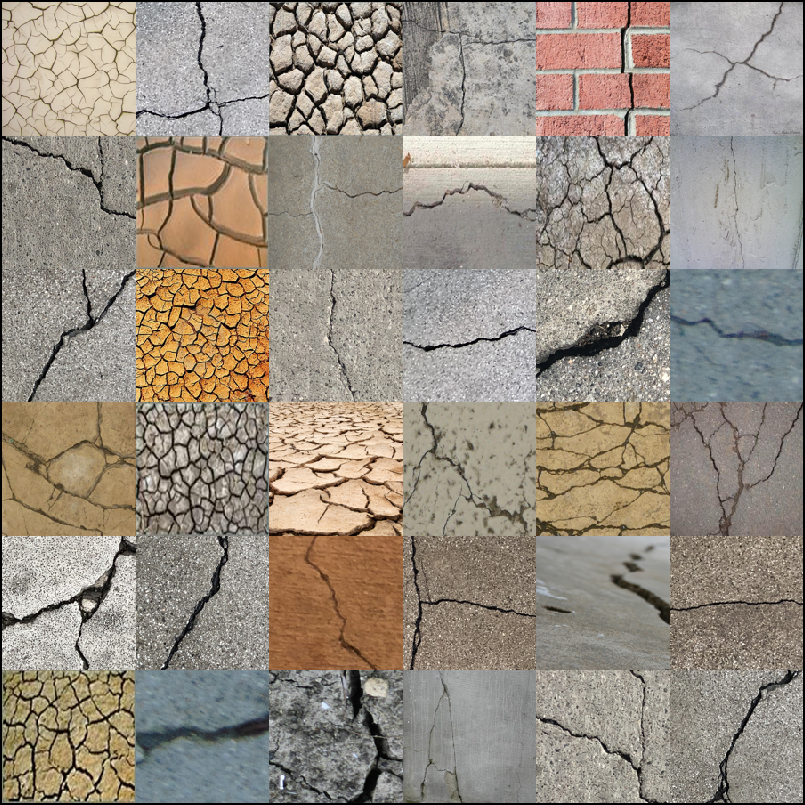
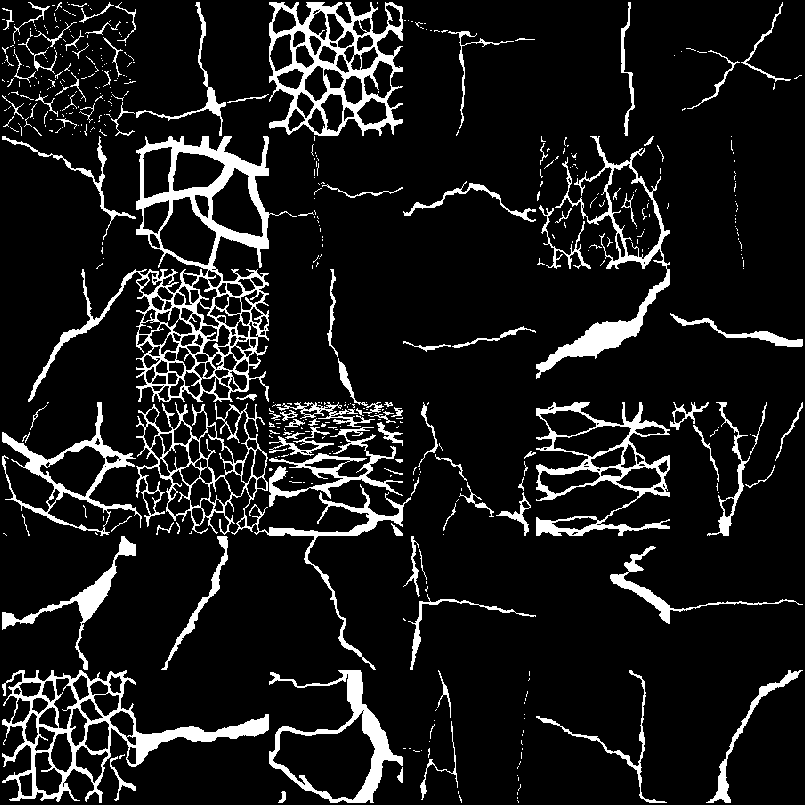
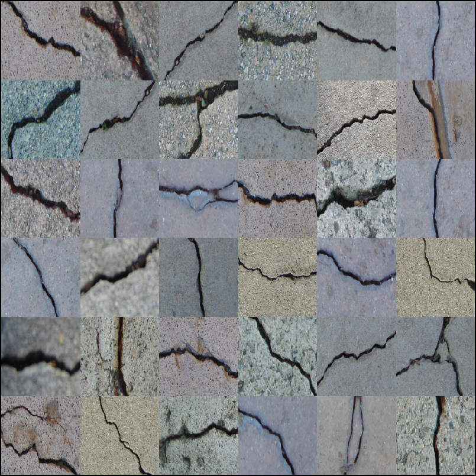
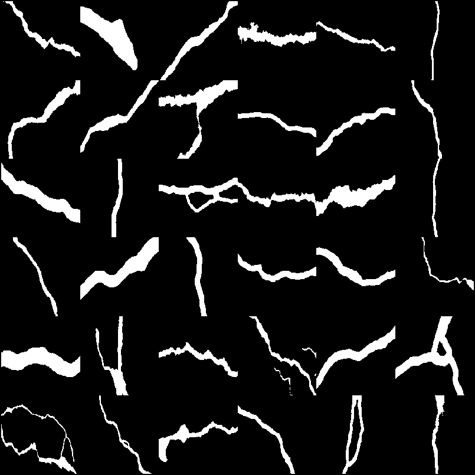
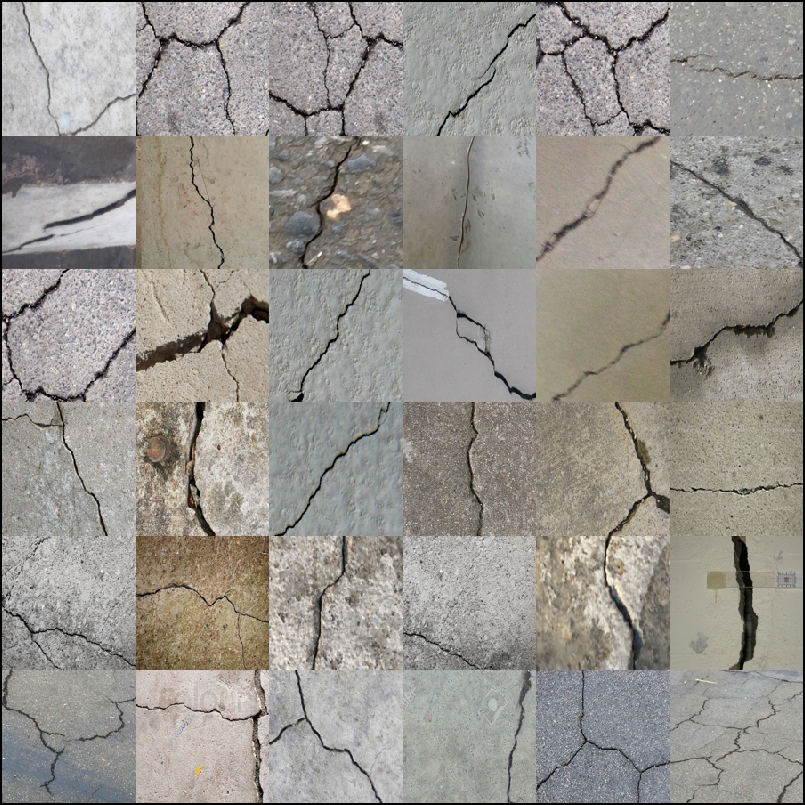
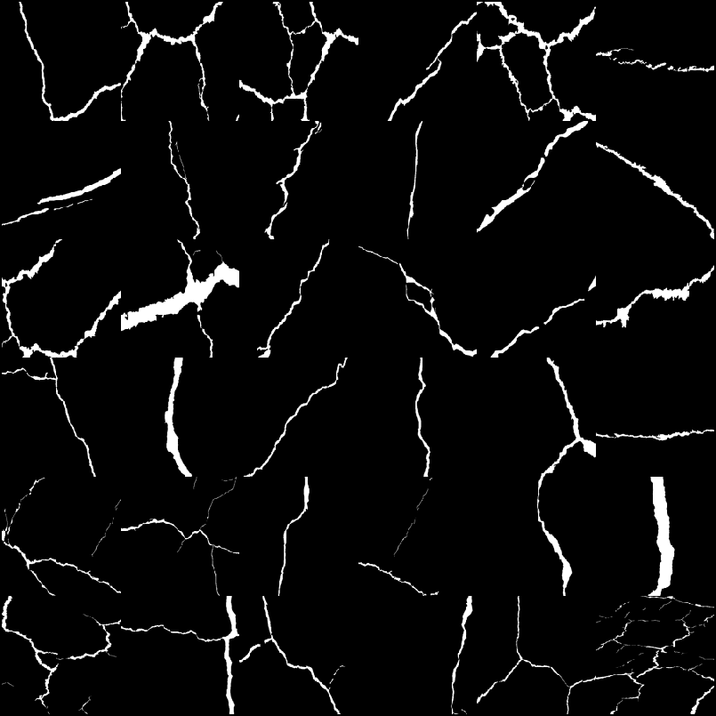
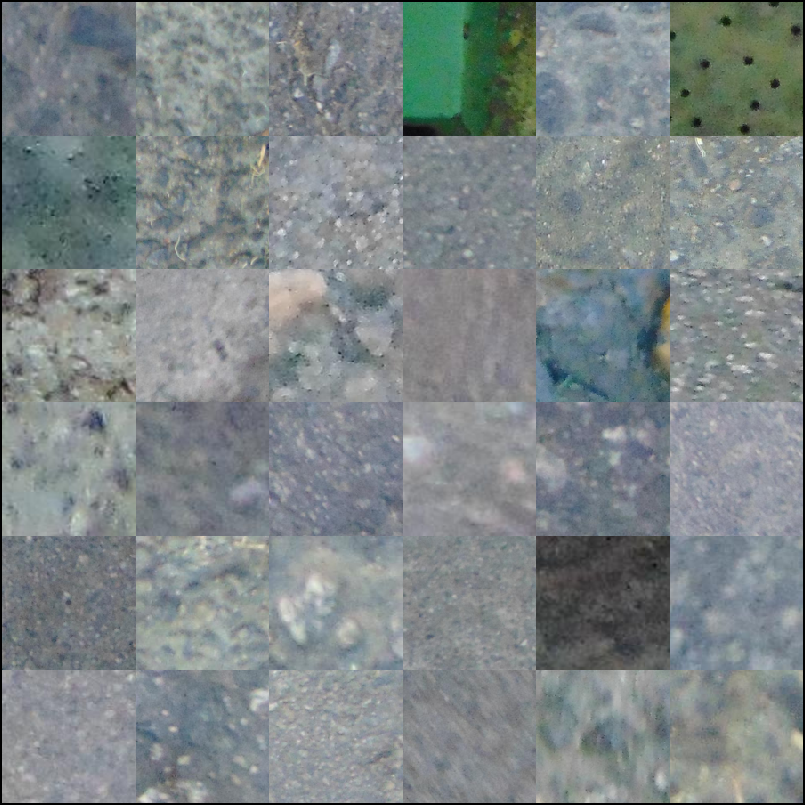

# Graph-based Synthetic Crack Generation via Dijkstra Path Tracing for Concrete and Pavement Crack Segmentation

All synthetic datasets, real-world reference datasets, and the analysis/plotting code used in the paper below can be downloaded from this repository.

**Paper:** [Graph-based synthetic crack generation via Dijkstra path tracing for concrete and pavement crack segmentation](https://www.sciencedirect.com/science/article/abs/pii/S0926580526003638)  
**Authors:** Preetham Manjunatha, Sami F. Masri, Aiichiro Nakano  
**Journal:** Automation in Construction, Volume 190, Article 107122 (2026)  
**DOI:** [10.1016/j.autcon.2026.107122](https://doi.org/10.1016/j.autcon.2026.107122)

<!-- ABSTRACT-PLACEHOLDER: paste exact abstract text from ScienceDirect here -->

## Abstract

> Accurate crack detection in concrete and pavement is constrained by scarce, costly, and inconsistent annotated datasets. Manual inspections are labor-intensive and subjective, while deep learning models struggle to generalize due to limited and imbalanced data. This paper introduces a synthetic crack-generation framework that models cracks as graphs and applies Dijkstra’s shortest-path algorithm to reproduce realistic crack tortuosity. Pixel-level skeletons are refined through morphological dilation, geometric transformations, and elastic deformations to generate cracks with diverse widths, orientations, and surface irregularities. The framework synthesizes transverse, longitudinal, shear, branched, multi-branched, and fatigue cracks, producing 960,731 unique samples. Validation against real cracks using morphological, topological, width, and contour features shows strong agreement, with low Fréchet Distance and maximum mean discrepancy. Models trained exclusively on synthetic data achieve segmentation performance comparable to human-annotated training, suggesting the framework as a scalable supplement to manual labeling and supporting integration with GAN and diffusion-based generative models.

## Highlights

<!-- HIGHLIGHTS-PLACEHOLDER: paste exact highlight bullets from ScienceDirect here -->

- Graph-based crack synthesis using Dijkstra path tracing to model tortuosity.
- Morphology + dilation, geometric warps, and elastic deformation yield realistic edges/widths.
- Generates diverse crack families (transverse, branched, multi-branched, fatigue) at scale.
- Releases 960,731 unique synthetic cracks validated by FD
  10 and MMD similarity tests.
- Synthetic-only training achieves F1/mIoU scores comparable to those of models trained on human-labeled data.

---

## Repository Structure

```
.
├── MATLAB - Image Segmentor and Analysis/  # Classical-ML (ANN/KNN/SVM) crack segmentation, training & evaluation
├── MAT Files/                   # Cached features, trained models & GT (download separately, see MAT Files)
├── Python - Feature Analysis/   # Component-level feature extraction, coverage & distribution-gap analysis
├── Python Plots/                # Result parsing, LaTeX tables, and comparison figures used in the paper
├── Results/                     # Generated figures, real-world crack samples, and raw/parsed metric dumps
├── assets/                      # Sample crack / ground-truth thumbnails used in this README
└── LICENSE
```

> Note: a few large/binary sub-folders referenced below (`Results/Mat Files`, `Results/Paper Figs`, `Results/Texture Plots`, MATLAB sources, and pre-extracted `.mat`/`.pdf` feature archives) are excluded from version control via `.gitignore` due to file size. They are described here for completeness but must be regenerated locally or requested from the authors.

### `MATLAB - Image Segmentor and Analysis/`

This folder is the **classical-ML crack-segmentation and evaluation pipeline** used to validate the graph-based synthetic crack images (and the elastic-deformation-augmented real-world crack images). It extracts vesselness/morphological features from connected components of a binarized crack-candidate map, classifies each component as crack/non-crack with ANN, KNN, and SVM models, and scores the result against the GSC, CDLN, and DeepCrack (Liu) datasets. It also contains the ablation-study training runs (one-pixel-wide → morphological dilation → geometric transform → elastic deformation) and the paper's texture/montage figure scripts.

All drivers add `../MAT Files` to the MATLAB path to read and write their cached artifacts (see [MAT Files](#mat-files) below). The augmentation driver also adds `../MATLAB - Crackmasks`.

#### Vendored third-party toolboxes

- **`functions/` and `shortestpath/`**: D. Kroon's (University of Twente) Accurate Fast Marching / shortest-path toolbox. It provides `msfm2d`/`msfm3d` (multistencil fast marching / eikonal distance maps, with C sources and compiled `.mexw64`), `pointmin` (steepest-descent neighbor lookup), and `e1`/`rk4`/`s1` (Euler / 4th-order Runge-Kutta / simple-step path tracers). The top-level `msfm.m` and `shortestpath.m` dispatch into these. Together they implement the fast-marching centerline extraction used as the `'fast_marching'` thinning option in `skeletonFMM.m`, `crack_deBrancher_BP2EPnBP_LengthConstraint_Feb2019.m`, `Calculate_CrackWidthLength_Paper.m`, and `clusterCracksStrands.m`.
- **`skeleton_win.mexw64` / `skeleton_unix.mexa64` / `skeleton_mac.mexmaci64`**: a compiled, platform-specific skeleton/pruning kernel. It backs the default `'alex'` thinning option (`inpstruct.thinPruneMethod`), with pruning threshold `thinPruneThresh × max(image size)`.
- **`voronoiSkel.m`**: Voronoi-tessellation skeletonization (uses the vendored `qhull.exe`). It is the `'voronoi'` thinning option for thick blobs.
- **`FrangiFilter2D.m` / `Hessian2D.m` / `eig2image.m`**: D. Kroon / M. Schrijver's 2D Frangi vesselness filter (Hessian eigenvalue ratios).
- **`FractionalIstropicTensor.m` / `ProbabiliticFractionalIstropicTensor.m`**: the MFAT (Multiscale Fractional Anisotropy Tensor) vesselness filter by H. F. Alhasson, building on T. Jerman's Hessian-eigenvalue code. It is an alternative to Frangi.
- **`sfta.m`**: Segmentation-based Fractal Texture Analysis (A. F. Costa et al., SIBGRAPI 2012).
- **`hausDim.m`**: Hausdorff/box-counting fractal dimension (A. F. Costa).
- **`skeletonOrientation.m`**: local orientation of a binary skeleton over a sliding block.
- **`multiclass_metrics.m`**: general confusion-matrix metrics (originally by Abbas Manthiri S).

#### Main pipeline orchestrators

Each stage is a **parameter script** (`MainInputs_*.m`, which sets the `train_inpstruct` / `inpstruct` / `jahan_inpstruct` / `hybrid_inpstruct` structs) paired with a **driver script** (`Main_*.m`, which calls the parameter script first). Execution order:

1. Build the synthetic training features.
2. Build the real-world training features.
3. Augment the real-world cracks with elastic deformation and combine them with the real-world and synthetic features.
4. Train the ANN/KNN/SVM classifiers.
5. Run each trained model over the public test sets and score the results.

| Stage                                                 | Parameter script                                    | Driver script                                        |
| ----------------------------------------------------- | --------------------------------------------------- | ---------------------------------------------------- |
| Synthetic training data (full set + ablation subsets) | `MainInputs_Training_Synthetic_Dataset.m`         | `Main_Training_Synthetic_Dataset_Parfor.m`         |
| Real-world training/validation data                   | `MainInputs_Training_Realworld_Dataset.m`         | `Main_Training_Realworld_Dataset_Parfor.m`         |
| Real-world + elastic-deformation augmentation         | `MainInputs_Training_Realworld_Augment_Dataset.m` | `Main_Training_Realworld_Augment_Dataset_Parfor.m` |
| Testing: GSC (Graph Synthetic Crack)                  | `MainInputs_TestingDataset_GSC.m`                 | `Main_TestingDataset_GSC.m`                        |
| Testing: CDLN (Cracks-1K)                             | `MainInputs_TestingDataset_CDLN.m`                | `Main_TestingDataset_CDLN.m`                       |
| Testing: Liu/DeepCrack                                | `MainInputs_TestingDataset_Liu.m`                 | `Main_TestingDataset_Liu.m`                        |

- **Synthetic driver.** It lists the non-crack and synthetic-crack images (cached in `ZZZ_Train_images_SyncracksAll*.mat`) and builds a per-blob feature matrix + labels with `largeFeaturematrixNlabels2025.m`. That matrix is concatenated with the pre-computed non-crack feature set (`ZZZ_FeatMAT_5JahanFeat_Labels_noncracks_<method>.mat`). Crack and non-crack rows are deduplicated separately (`unique(...,'stable','rows')`) and balanced to the smaller class count (960,731 for the full synthetic set). The result is shuffled (`shuffleFeatMatLabel.m`) and split 70/5/25 into train/val/test (`SplitDataLabels.m`), producing the final `ZZZ_XYTargets5JahanFeat_*` file consumed by the classifiers. Switching `synimgFolder` / `Traindata_folders_syncracks` and the output filenames between the full set and the `Pixel Wide` / `Morpho Dilated` / `Geo Trans` / `Elastic Def` folders produces the `SynAll` and `Syn_Ablation_*` artifacts.
- **Real-world driver.** It extracts features directly from the binary ground-truth masks of the CDLN (Cracks-1K), DeepCrack, and GSC `train`/`val` pixel-label folders (`largeFeaturematrixNlabelsRealworldData2025.m`; no vesselness filtering is needed). These are combined with the synthetic non-crack rows of the chosen method (`combineCrackNoncrackFML.m`) and deduplicated (`uniqueCrackNoncrackFML.m`) into separate `_Train_AllDS` / `_Val_AllDS` sets. The real-world validation split is used as the classifier validation set.
- **Augmentation driver.** It extracts features from the elastic-deformation-augmented real-world crack images and concatenates real + augmented + synthetic crack rows (`concatenateCracksFM.m`, deduplicated on the 3rd feature column). The result is then combined with non-cracks, deduplicated, and split as above. The upstream image-generation steps sit in the same script but are commented out, because they have already been run:

  1. Cluster real-world cracks by branch-point count (`clusterCracksStrands.m`, clusters `[0, 1]`).
  2. Apply elastic deformation (`augmentCracks.m`, which calls `elastic_def_multiplicator.m` from `../MATLAB - Crackmasks/`; 20 deformations per crack; `affine` / `projective` / `piecewise_linear` / `local_weighted_mean` warps).
  3. Clean the outputs (`deleteEmptyImages.m`, `binarizeImages.m`, `orphanBlobsRemoveImages.m`).

  This dataset most directly embodies the paper's elastic-deformation-augmentation contribution.
- **Testing harnesses.** Each one loads a pre-cached ground truth (`ZZZ_GT_Dataset_<DS>_{Dragon,Kraken}_cracks_only.mat`, built once via `GTMaker_Dataset_*.m` → `GTExtractor_2020_ParFor.m` and selected by the machine's `COMPUTERNAME`). It builds crack/non-crack file lists and calls `ProcessFilesStoreResults_Compact.m`. That script sweeps `Algorithm_TYPE` (`hybrid_hessian` / `hybrid_MFAT` / `morpho`) × hyperparameter permutations, loads the matching pre-trained ANN/KNN/SVM models, and runs `Processed_Results.m` → `classifierResult_2017Revised.m`/`classifierResult_2020_ParFor.m` → `store_ROC_Values.m` → `calculate_Results2Write.m` → `wrtiteOutputs2TextFile.m`. The output is written to `../Results/Text Files/pp_hybrid_morpho_marathon_{GSC,CDLN,Liu}_*.txt`, which `Python Plots/average_table.py` parses.
- **Choosing the trained model.** `hybrid_inpstruct.classfier_trained_model` in each testing parameter script selects the models to evaluate, and each choice writes its qualitative outputs to montage sub-folder `01`–`10`:

  | `classfier_trained_model`              | MAT test case                         | Montage dir |
  | ---------------------------------------- | ------------------------------------- | ----------- |
  | `'million_unique_all'`                 | `SynAll`                            | `01`      |
  | `'unique_100000'`                      | `Syn_100000`                        | `02`      |
  | `'real_world'`                         | `Realworld`                         | `03`      |
  | `'real_world_augmented_only'`          | `Realworld_elasticDefAug`           | `04`      |
  | `'real_world+augmented'`               | `Realworld+elasticDefAug`           | `05`      |
  | `'real_world+augmented+synthetic'`     | `Realworld+elasticDefAug+synthetic` | `06`      |
  | `'one_pixel_wide'` *(ablation)*      | `Syn_Ablation_PixWide`              | `07`      |
  | `'with_morpho_dilated'` *(ablation)* | `Syn_Ablation_MorphoDil`            | `08`      |
  | `'with_geo_trans'` *(ablation)*      | `Syn_Ablation_GeoTrans`             | `09`      |
  | `'with_elastic_def'` *(ablation)*    | `Syn_Ablation_ElaDef`               | `10`      |

> Notes on running the scripts as-is:
>
> - The parameter scripts hold the configuration of the **last run** (e.g., `MainInputs_Training_Synthetic_Dataset.m` is set to the `Pixel Wide` ablation subset, and the real-world/augmentation drivers hard-code the `hessian` intermediate filenames). Edit the input folders, `Algorithm_TYPE`, and the `ZZZ_*` filenames for each method × test-case combination you want to regenerate.
> - Input image paths are absolute local paths (`H:\...`, `F:\...`) and must be pointed at your copies of the [datasets](#datasets).
> - The Linux branch of the testing drivers loads `ZZZ_GT_Dataset_{Jahan,CDLN,Liu}_cracks_only_Linux.mat`, which is not in `MAT Files` (the GSC driver still references the older `Jahan` name). On Windows, the GT cache is chosen by `COMPUTERNAME` (`PREETHAM-DRAGON` / `PREETHAM-KRAKEN`), so rename the cache file or the check to match your machine.
> - `*.asv` files (`datasetTester3Methods.asv`, `MainInputs_TestingDataset_GSC.asv`, `Main_TestingDataset_GSC.asv`, `functions/pointmin.asv`) are MATLAB editor autosave backups and are not used by the pipeline.

#### Feature extraction ("Hessian" / "MFAT" / "Morpho" methods, "5 Jahan features")

The pipeline supports three interchangeable ways of turning a grayscale image into a binary crack-candidate map. Each is followed by the **same** 5-feature morphological descriptor set:

- **Hessian**: `FrangiFilter2D.m` / `Hessian2D.m` / `eig2image.m` (Frangi vesselness; default scale range `[0.7181, 5]`, β₁ = 0.5, β₂ = 25).
- **MFAT**: `FractionalIstropicTensor.m` / `ProbabiliticFractionalIstropicTensor.m` (probabilistic FAT by default), with `ProbabiliticMFATSigmas.m` / `ProbabiliticMFATSpacing.m` for hyperparameter sweeps. `MFAT_GaussainKernelSizeVsCrackThicknessRelation.m` studies how the MFAT Gaussian kernel size relates to crack thickness.
- **Morpho**: `funct_crackDetect_Salembier_Sinha_Jahan.m` (multi-directional morphological opening/closing with line structuring elements at 0°/45°/90°/135°, Otsu-thresholded).

Each candidate map is Otsu-binarized, blob-size filtered (`blobFilter.m`, optional `filter_stage_I.m` close/bridge/spur/clean cleanup), and passed to `crack_non_crackfeaturesNlabels_2018Revised_5JahanFeatures.m`. That function computes the **5 Jahan features** per connected component:

1. eccentricity
2. ellipse-fill ratio (Area / (π·MajorAxis·MinorAxis))
3. solidity
4. row/column coordinate correlation (linearity)
5. compactness (√(Area/Perimeter))

It also computes GT-overlap labeling (`CC_overlap_percent` = 0.5), branch-point/hole counts, and a circularity index used by the optional post-processing filter.

- `largeFeaturematrixNlabels2025.m`: batch feature-matrix driver for synthetic training images (runs the selected filter types in chunks of `1e5`).
- `largeFeaturematrixNlabelsRealworldData2025.m`: batch driver for real-world GT masks (already binary, so it skips filtering).
- `extractFrangiMFAT_Results.m` / `extract_metrics.m`: aggregate precision/recall/F1 arrays across a hyperparameter grid search, split by algorithm type.

#### Classifiers

Each training script loops over a list of `ZZZ_XYTargets5JahanFeat_*.mat` files and saves the matching `ZZZ_Mdl{ANN,KNN,SVM}_*.mat` model.

- `ANNClassifier.m`: trains a `patternnet` (single hidden layer, `trainscg`, cross-entropy) on the saved `Xtrain/Xval/Xtest` split.
- `ANNClassifier_Hybrid_Iterative.m`: grid search over 1–3 hidden-layer size combinations to tune the architecture.
- `KNNClassifier.m`: `fitcknn` (k = 5, exhaustive search, Euclidean).
- `SVMClassifier.m`: `fitcsvm` (RBF or polynomial kernel).
- `classifierResult_2017Revised.m` / `classifierResult_2020_ParFor.m`: sequential and parallel per-image test-time inference. They re-run the selected filter, classify each blob with all three models, and compute pixel- and bbox-level TP/FP/FN/TN.
- `RealCracksClassifierOutput_Paper.m`: lightweight single-image inference wrapper for qualitative paper figures. It removes non-crack blobs via `fixClass2Labels.m`.

#### Ground-truth / public-dataset tooling

- `GTMaker_Dataset_GSC.m` / `GTMaker_Dataset_CDLN.m` / `GTMaker_Dataset_Liu.m`: one-time GT pre-processing per dataset. Each caches bbox + pixel-level ground truth (`objBoxCracksnNoncracksGTs`, `ssmPixCracksnNoncracksGTs`) via `GTExtractor_2020_ParFor.m`.
- `Extract_Public_Dataset_Cracks2Classes.m`: splits public GT images into per-crack-strand files using `voronoiSkel`-based skeletonization.
- `jpg2png.m`: converts JPEG GT masks to binarized PNGs (used for an external concrete-crack dataset).

#### Crack skeleton & geometry analysis

- `crack_deBrancher.m`, `crack_deBrancher_BPLengthConstraint.m`, `crack_deBrancher_BP2EPnBP_LengthConstraint_Feb2019.m`: successive versions of the branch-point "debranching" algorithm that splits a multi-strand crack mask into independent segments (first circle-fill, then length-constrained, then full graph traversal via `BPDetection_Mohsin.m`).
- `BPDetection_Mohsin.m`, `Points.m`, `Strand.m`: skeleton-graph traversal data structures.
- `crackWidthLocation.m`, `Calculate_CrackWidthLength_Paper.m`, `bresenham.m`: measure local and overall crack width and length along the skeleton normal (thinning via `'conventional'` / `'alex'` / `'voronoi'` / `'fast_marching'`).
- `CrackWidthInfoOnDataset_Paper.m`: runs the width/length measurement over a whole dataset to produce the paper's crack-geometry statistics.
- `clusterCracksStrands.m`: sorts real-world crack images by branch-point count to select single-strand cracks for augmentation.
- `skeletonFMM.m`: fast-marching-based sub-pixel skeleton extraction.
- `hausDim.m`: fractal dimension of a binary crack mask.

#### Texture analysis

These scripts group dataset images by surface texture, for the dataset-characterization figures.

- `TexturePlot2020.m` + `TexturePlot_Inputs.m`: driver and parameters. They extract a texture descriptor per image, cluster with k-means (`k` = 2), and plot the texture-class distribution. Results are cached to `ZZZ_texture_{GSC,CDLN,DeepCrack}_Dataset*.mat` and plots go to `Results/Texture Plots/`.
- `texturefeatures2020.m`: per-image texture feature extraction with a selectable filter:
  - `laws_filter.m`: Laws multi-channel level/edge/spot/ripple/wave energy filters.
  - `sfta.m`: SFTA fractal texture.
  - `glcm_textureFilter.m`: GLCM contrast/correlation/energy/homogeneity (A. Manjunath).
- `clusterimages.m`: k-means clustering of texture vectors (optionally copies the images into per-cluster folders).
- `textureclass_bincount.m`, `plot3Dbargraph2020.m`: bin images by resolution (megapixels) × texture class and render the 3-D bar charts.

#### Evaluation / metrics

- `ROC_Curves_TrainingDataset.m` / `ROC_Curves_TestingDataset.m`: ROC/precision-recall curve plotting (`perfcurve`) for the held-out split and for the test sets.
- `TruePositive_FalsePositive_FalseNegative_Pixel_2018.m` / `TruePositive_FalsePositive_FalseNegative_Bbox_2021b.m`: pixel-level and IoU-matched bbox-level TP/FP/FN/TN.
- `multiclass_metrics.m` / `multiclassPrecision_Recall.m`: accuracy, precision, recall, F1, specificity, MCC, and kappa, derived from the confusion matrix.
- `store_ROC_Values.m`, `calculate_Results2Write.m`, `AllMetricsTextFile.m`, `wrtiteOutputs2TextFile.m`: accumulate and write out per-run metrics and comparison-table metrics (ANN vs. KNN vs. SVM).
- `Processed_Results.m`, `ProcessFilesStoreResults.m` / `_ParFor.m` / `_Compact.m`: orchestrate the per-hyperparameter test loop (`_Compact` is the version currently in use).

#### Paper figure scripts

- `Datasets_Results_Montage_Paper_1.m` / `_2.m` / `_3.m`: qualitative montages of the Hessian/MFAT/Morpho predictions for each dataset and each trained-model variant (`01`–`06`), next to the image and GT.
- `SyntheticCrack_nonCrack_Montageplot_Paper.m`: montage of synthetic crack vs. non-crack training blobs (`Results/Figures/fig_train_dataset_*_sample.pdf`).
- `synMontage.m`, `synMontageElasticDef.m`, `synMontage_unrealistic.m`: montages of the generated synthetic cracks, their elastic-deformation variants, and examples of unrealistic samples.
- `Datasets_ImageSizes_Paper.m`: image-resolution statistics of the datasets.

#### Misc utilities

`addborder.m`, `arclength.m`, `getmidpointcircle.m`, `hysthresh.m`, `filenamesort.m`, `natsort.m`, `normalize.m`, `rmse.m`, `randomString.m`, `imoverlay.m`, `ImageWriter.m`, `imconversion2gray.m`, `PoolWaitbar.m`, `waitbarParfor.m`, `groundNnoisy_BWimage.m`, `blobFilter.m`, `filter_stage_I.m`, `orphanBlobsRemoveImages.m`, `deleteEmptyImages.m`, `binarizeImages.m`, `shuffleFeatMatLabel.m`, `combineCrackNoncrackFML.m`, `concatenateCracksFM.m`, `uniqueCrackNoncrackFML.m`, `fixClass2Labels.m`, `SplitDataLabels.m`, `getFoldersImds.m`, `vislabels.m`, `vis_Labels_CircIndex.m`, `augmentCracks.m`: image I/O, sorting, normalization, deduplication, dataset-splitting, and visualization helpers used throughout the pipeline above.

### `Python - Feature Analysis/`

Component-level feature extraction and real-vs-synthetic distribution analysis pipeline.

| File                                                    | Description                                                                                                                                                                                                                                                        |
| ------------------------------------------------------- | ------------------------------------------------------------------------------------------------------------------------------------------------------------------------------------------------------------------------------------------------------------------ |
| `crack_feature_factory.py`                            | Extracts per-component crack features (morphology, width, topology, contour) and simplified skeleton graphs from real-world and synthetic crack masks. Parallelized with`joblib`; writes a unified Parquet file combining numeric features and graph edge-lists. |
| `compute_global_metrics.py`                           | Computes distributional-similarity metrics —**FID**, **MMD²**, **Coverage95**, **Density95** — between real-world and synthetic crack populations, per feature family.                                                                  |
| `dim_reduce_visualize.py`                             | Produces PCA / t-SNE / UMAP 2-D projections per feature family (morphology, width, topology, contour) as publication-ready PDFs.                                                                                                                                   |
| `radar_report.py`                                     | Aggregates per-dataset feature medians and renders radar/spider charts per feature family.                                                                                                                                                                         |
| `find_uncovered.py`                                   | Flags real-world crack components whose feature vector lies farther than a distance threshold (default: 95th percentile) from every synthetic component — used to identify coverage gaps in the synthetic generator.                                              |
| `view_image_comp_ids.py`                              | Utility to isolate and preview a single connected component from a full crack mask by component ID.                                                                                                                                                                |
| `crack_features_{200,5000,10000,15000,25000}.parquet` | Extracted feature tables at increasing synthetic-dataset scales (200 → 25,000 synthetic cracks), each combined with the fixed real-world feature set.                                                                                                             |
| `global_metrics.csv`                                  | Output of`compute_global_metrics.py`: FID / MMD² / Coverage95 / Density95 per feature family, computed over 13,152 real-world vs. 211,494 synthetic crack components.                                                                                           |
| `viz_outputs/`                                        | PCA/t-SNE/UMAP contour and scatter PDFs (`tsne_*`, `umap_*` × `contour`/`morphology`/`topology`/`width`) at each dataset scale.                                                                                                                       |

### `Python Plots/`

Parses raw MATLAB segmentation-metric dumps into LaTeX-ready tables and generates the paper's comparison figures.

| File                                                                  | Description                                                                                                                                                                                                                                                                               |
| --------------------------------------------------------------------- | ----------------------------------------------------------------------------------------------------------------------------------------------------------------------------------------------------------------------------------------------------------------------------------------- |
| `average_table.py`                                                  | Parses per-dataset (GSC / CDLN / DeepCrack) result`.txt` files by classifier (ANN / K-NN / SVM) × filter (Hessian / MFAT / Morpho), and writes averaged metrics to `average_metrics.txt` and a camera-ready `average_results_table.tex`. Also produces the `_ablation` variants. |
| `getmetrics2textfile.py`                                            | Parses MATLAB object-wise (pixel) classification results for the CDLN dataset and writes LaTeX-ready metric entries.                                                                                                                                                                      |
| `bar_plots_f1_miou.py`                                              | Builds grouped bar charts comparing F1-score and Mean IoU across the GSC, CDLN, and DeepCrack (Liu) datasets and classifier/filter combinations (`fig_f1_scores_v1.pdf`, `fig_MeanIoU_v1.pdf`).                                                                                       |
| `fig_methodology_flowchart*.drawio` / `.pdf`                      | draw.io sources and exported renders of the paper's methodology flowchart.                                                                                                                                                                                                                |
| `comparative_schematic.drawio`                                      | draw.io source for the comparative schematic figure.                                                                                                                                                                                                                                      |
| `average_metrics.txt`, `average_metrics_ablation.txt`             | Aggregated, human-readable metric summaries (main study and ablation study).                                                                                                                                                                                                              |
| `average_results_table.tex`, `average_results_table_ablation.tex` | Final LaTeX result tables used in the paper.                                                                                                                                                                                                                                              |

### `Results/`

| Sub-folder                          | Contents                                                                                                                                                                                                                                                                                                                                                                                                           |
| ----------------------------------- | ------------------------------------------------------------------------------------------------------------------------------------------------------------------------------------------------------------------------------------------------------------------------------------------------------------------------------------------------------------------------------------------------------------------ |
| `Figures/`                        | Example training samples —`fig_train_dataset_crack_sample.pdf`, `fig_train_dataset_non_crack_sample.pdf`.                                                                                                                                                                                                                                                                                                     |
| `Realworld cracks/`               | Curated real-world crack images grouped by topology, used in qualitative comparison figures:`branched_*`, `fatigue_*`, `long_*`, `multibranched_*`, `shear_*`.                                                                                                                                                                                                                                           |
| `Text Files/`                     | Raw MATLAB segmentation-result dumps (`pp_hybrid_morpho_marathon_{GSC,CDLN,Liu}_0..6.txt`), their parsed LaTeX table entries (`gsc_/cdln_/liu_LaTeX_table_entries.txt`), montage caption files (`realcrack_montage.txt`, `syncrack_montage.txt`, `synthetic_graphstructure_samples.txt`), `ensemble_marathon.txt`, and an `Ablation/` subfolder mirroring the same structure for the ablation study. |
| `Mat Files/` *(gitignored)*     | MATLAB workspace files backing the figures below.                                                                                                                                                                                                                                                                                                                                                                  |
| `Paper Figs/` *(gitignored)*    | Full-resolution paper figures: pairwise-distance plots per augmentation type (Elastic, Geometric-Transform, Morphological-Dilation, Pixel-Width), synthetic crack-graph renders per topology (branch, long, RRT, RRT\*, shear, surface, transverse), corresponding dilated/pixel-wide crack-mask renders, and the 100,000-crack synthetic montage.                                                                 |
| `Texture Plots/` *(gitignored)* | Texture/appearance comparison plots.                                                                                                                                                                                                                                                                                                                                                                               |

### `assets/`

Sample crack / ground-truth image pairs used to illustrate the real-world datasets in this README (see [Datasets](#datasets) below).

---

## MAT Files

> **Download:** the `MAT Files/` folder is **not** included in this repository because of its size. Download it from [MAT Files](https://1drv.ms/f/c/ab3a9bf088335851/IgD2am_djfLzQqbBjE856uSHASLDbBPG1Ke8qDm2BWis-UQ?e=xaWSg6) and place it at the repository root as `MAT Files/`, the sibling of `MATLAB - Image Segmentor and Analysis/`. The MATLAB scripts add it to the path via `addpath('../MAT Files')`.

`MAT Files` caches the image lists, feature matrices, train/val/test targets, trained classifiers, ground-truth caches, and texture descriptors produced by the [MATLAB pipeline](#matlab---image-segmentor-and-analysis). This means the classification and testing scripts don't need to recompute them. The trained-model and final feature/target files follow a consistent naming convention:

```
ZZZ_<ArtifactType>_<method>_<TestCase>.mat
```

- **`ArtifactType`**: `MdlANN` / `MdlKNN` / `MdlSVM` (a trained classifier) or `XYTargets5JahanFeat` (the corresponding 5-Jahan-feature matrix + `Xtrain/Xval/Xtest`, `Ytrain/Yval/Ytest`, `Targettrain/Targetval/Targettest` split).
- **`method`**: the feature-extraction method used to produce the crack-candidate map: **`hessian`** (Frangi), **`mfat`**, or **`morpho`** (morphological).
- **`TestCase`**: which dataset/augmentation combination the artifact was built from.

### Test cases

| Test case                             | Description                                                                                                                                                                             |
| ------------------------------------- | --------------------------------------------------------------------------------------------------------------------------------------------------------------------------------------- |
| `SynAll`                            | Full graph-based synthetic crack dataset + non-crack blobs. Crack and non-crack rows are deduplicated separately and balanced to 960,731 unique samples per class.                      |
| `Syn_100000`                        | 100,000-sample subsample of the synthetic set, used for faster training/iteration.                                                                                                      |
| `Realworld`                         | Features extracted directly from real-world ground-truth crack masks (CDLN + DeepCrack + GSC train; val split used for validation) with synthetic non-crack blobs, and no augmentation. |
| `Realworld_elasticDefAug`           | Features from the elastic-deformation-augmented real-world crack images only.                                                                                                           |
| `Realworld+elasticDefAug`           | Real-world + elastic-deformation-augmented real-world data combined.                                                                                                                    |
| `Realworld+elasticDefAug+synthetic` | Real-world + elastic-deformation-augmented real-world + synthetic data combined.                                                                                                        |
| `Syn_Ablation_PixWide`              | Ablation: synthetic cracks as one-pixel-wide Dijkstra skeletons only.                                                                                                                   |
| `Syn_Ablation_MorphoDil`            | Ablation: + variable-width morphological dilation.                                                                                                                                      |
| `Syn_Ablation_GeoTrans`             | Ablation: + geometric transformations.                                                                                                                                                  |
| `Syn_Ablation_ElaDef`               | Ablation: + elastic deformation.                                                                                                                                                        |

### Model / feature-matrix files, clustered by method × test case

#### Hessian

| Test case                         | ANN model                                                    | KNN model                                                    | SVM model                                                    | Feature/target matrix                                                     |
| --------------------------------- | ------------------------------------------------------------ | ------------------------------------------------------------ | ------------------------------------------------------------ | ------------------------------------------------------------------------- |
| SynAll                            | `ZZZ_MdlANN_hessian_SynAll.mat`                            | `ZZZ_MdlKNN_hessian_SynAll.mat`                            | `ZZZ_MdlSVM_hessian_SynAll.mat`                            | `ZZZ_XYTargets5JahanFeat_hessian_SynAll.mat`                            |
| Syn_100000                        | `ZZZ_MdlANN_hessian_Syn_100000.mat`                        | `ZZZ_MdlKNN_hessian_Syn_100000.mat`                        | `ZZZ_MdlSVM_hessian_Syn_100000.mat`                        | `ZZZ_XYTargets5JahanFeat_hessian_Syn_100000.mat`                        |
| Realworld                         | `ZZZ_MdlANN_hessian_Realworld.mat`                         | `ZZZ_MdlKNN_hessian_Realworld.mat`                         | `ZZZ_MdlSVM_hessian_Realworld.mat`                         | `ZZZ_XYTargets5JahanFeat_hessian_Realworld.mat`                         |
| Realworld_elasticDefAug           | `ZZZ_MdlANN_hessian_Realworld_elasticDefAug.mat`           | `ZZZ_MdlKNN_hessian_Realworld_elasticDefAug.mat`           | `ZZZ_MdlSVM_hessian_Realworld_elasticDefAug.mat`           | `ZZZ_XYTargets5JahanFeat_hessian_Realworld_elasticDefAug.mat`           |
| Realworld+elasticDefAug           | `ZZZ_MdlANN_hessian_Realworld+elasticDefAug.mat`           | `ZZZ_MdlKNN_hessian_Realworld+elasticDefAug.mat`           | `ZZZ_MdlSVM_hessian_Realworld+elasticDefAug.mat`           | `ZZZ_XYTargets5JahanFeat_hessian_Realworld+elasticDefAug.mat`           |
| Realworld+elasticDefAug+synthetic | `ZZZ_MdlANN_hessian_Realworld+elasticDefAug+synthetic.mat` | `ZZZ_MdlKNN_hessian_Realworld+elasticDefAug+synthetic.mat` | `ZZZ_MdlSVM_hessian_Realworld+elasticDefAug+synthetic.mat` | `ZZZ_XYTargets5JahanFeat_hessian_Realworld+elasticDefAug+synthetic.mat` |
| Syn_Ablation_PixWide              | `ZZZ_MdlANN_hessian_Syn_Ablation_PixWide.mat`              | `ZZZ_MdlKNN_hessian_Syn_Ablation_PixWide.mat`              | `ZZZ_MdlSVM_hessian_Syn_Ablation_PixWide.mat`              | `ZZZ_XYTargets5JahanFeat_hessian_Syn_Ablation_PixWide.mat`              |
| Syn_Ablation_MorphoDil            | `ZZZ_MdlANN_hessian_Syn_Ablation_MorphoDil.mat`            | `ZZZ_MdlKNN_hessian_Syn_Ablation_MorphoDil.mat`            | `ZZZ_MdlSVM_hessian_Syn_Ablation_MorphoDil.mat`            | `ZZZ_XYTargets5JahanFeat_hessian_Syn_Ablation_MorphoDil.mat`            |
| Syn_Ablation_GeoTrans             | `ZZZ_MdlANN_hessian_Syn_Ablation_GeoTrans.mat`             | `ZZZ_MdlKNN_hessian_Syn_Ablation_GeoTrans.mat`             | `ZZZ_MdlSVM_hessian_Syn_Ablation_GeoTrans.mat`             | `ZZZ_XYTargets5JahanFeat_hessian_Syn_Ablation_GeoTrans.mat`             |
| Syn_Ablation_ElaDef               | `ZZZ_MdlANN_hessian_Syn_Ablation_ElaDef.mat`               | `ZZZ_MdlKNN_hessian_Syn_Ablation_ElaDef.mat`               | `ZZZ_MdlSVM_hessian_Syn_Ablation_ElaDef.mat`               | `ZZZ_XYTargets5JahanFeat_hessian_Syn_Ablation_ElaDef.mat`               |

#### MFAT

| Test case                         | ANN model                                                 | KNN model                                                 | SVM model                                                 | Feature/target matrix                                                  |
| --------------------------------- | --------------------------------------------------------- | --------------------------------------------------------- | --------------------------------------------------------- | ---------------------------------------------------------------------- |
| SynAll                            | `ZZZ_MdlANN_mfat_SynAll.mat`                            | `ZZZ_MdlKNN_mfat_SynAll.mat`                            | `ZZZ_MdlSVM_mfat_SynAll.mat`                            | `ZZZ_XYTargets5JahanFeat_mfat_SynAll.mat`                            |
| Syn_100000                        | `ZZZ_MdlANN_mfat_Syn_100000.mat`                        | `ZZZ_MdlKNN_mfat_Syn_100000.mat`                        | `ZZZ_MdlSVM_mfat_Syn_100000.mat`                        | `ZZZ_XYTargets5JahanFeat_mfat_Syn_100000.mat`                        |
| Realworld                         | `ZZZ_MdlANN_mfat_Realworld.mat`                         | `ZZZ_MdlKNN_mfat_Realworld.mat`                         | `ZZZ_MdlSVM_mfat_Realworld.mat`                         | `ZZZ_XYTargets5JahanFeat_mfat_Realworld.mat`                         |
| Realworld_elasticDefAug           | `ZZZ_MdlANN_mfat_Realworld_elasticDefAug.mat`           | `ZZZ_MdlKNN_mfat_Realworld_elasticDefAug.mat`           | `ZZZ_MdlSVM_mfat_Realworld_elasticDefAug.mat`           | `ZZZ_XYTargets5JahanFeat_mfat_Realworld_elasticDefAug.mat`           |
| Realworld+elasticDefAug           | `ZZZ_MdlANN_mfat_Realworld+elasticDefAug.mat`           | `ZZZ_MdlKNN_mfat_Realworld+elasticDefAug.mat`           | `ZZZ_MdlSVM_mfat_Realworld+elasticDefAug.mat`           | `ZZZ_XYTargets5JahanFeat_mfat_Realworld+elasticDefAug.mat`           |
| Realworld+elasticDefAug+synthetic | `ZZZ_MdlANN_mfat_Realworld+elasticDefAug+synthetic.mat` | `ZZZ_MdlKNN_mfat_Realworld+elasticDefAug+synthetic.mat` | `ZZZ_MdlSVM_mfat_Realworld+elasticDefAug+synthetic.mat` | `ZZZ_XYTargets5JahanFeat_mfat_Realworld+elasticDefAug+synthetic.mat` |
| Syn_Ablation_PixWide              | `ZZZ_MdlANN_mfat_Syn_Ablation_PixWide.mat`              | `ZZZ_MdlKNN_mfat_Syn_Ablation_PixWide.mat`              | `ZZZ_MdlSVM_mfat_Syn_Ablation_PixWide.mat`              | `ZZZ_XYTargets5JahanFeat_mfat_Syn_Ablation_PixWide.mat`              |
| Syn_Ablation_MorphoDil            | `ZZZ_MdlANN_mfat_Syn_Ablation_MorphoDil.mat`            | `ZZZ_MdlKNN_mfat_Syn_Ablation_MorphoDil.mat`            | `ZZZ_MdlSVM_mfat_Syn_Ablation_MorphoDil.mat`            | `ZZZ_XYTargets5JahanFeat_mfat_Syn_Ablation_MorphoDil.mat`            |
| Syn_Ablation_GeoTrans             | `ZZZ_MdlANN_mfat_Syn_Ablation_GeoTrans.mat`             | `ZZZ_MdlKNN_mfat_Syn_Ablation_GeoTrans.mat`             | `ZZZ_MdlSVM_mfat_Syn_Ablation_GeoTrans.mat`             | `ZZZ_XYTargets5JahanFeat_mfat_Syn_Ablation_GeoTrans.mat`             |
| Syn_Ablation_ElaDef               | `ZZZ_MdlANN_mfat_Syn_Ablation_ElaDef.mat`               | `ZZZ_MdlKNN_mfat_Syn_Ablation_ElaDef.mat`               | `ZZZ_MdlSVM_mfat_Syn_Ablation_ElaDef.mat`               | `ZZZ_XYTargets5JahanFeat_mfat_Syn_Ablation_ElaDef.mat`               |

#### Morpho

| Test case                         | ANN model                                                   | KNN model                                                   | SVM model                                                   | Feature/target matrix                                                    |
| --------------------------------- | ----------------------------------------------------------- | ----------------------------------------------------------- | ----------------------------------------------------------- | ------------------------------------------------------------------------ |
| SynAll                            | `ZZZ_MdlANN_morpho_SynAll.mat`                            | `ZZZ_MdlKNN_morpho_SynAll.mat`                            | `ZZZ_MdlSVM_morpho_SynAll.mat`                            | `ZZZ_XYTargets5JahanFeat_morpho_SynAll.mat`                            |
| Syn_100000                        | `ZZZ_MdlANN_morpho_Syn_100000.mat`                        | `ZZZ_MdlKNN_morpho_Syn_100000.mat`                        | `ZZZ_MdlSVM_morpho_Syn_100000.mat`                        | `ZZZ_XYTargets5JahanFeat_morpho_Syn_100000.mat`                        |
| Realworld                         | `ZZZ_MdlANN_morpho_Realworld.mat`                         | `ZZZ_MdlKNN_morpho_Realworld.mat`                         | `ZZZ_MdlSVM_morpho_Realworld.mat`                         | `ZZZ_XYTargets5JahanFeat_morpho_Realworld.mat`                         |
| Realworld_elasticDefAug           | `ZZZ_MdlANN_morpho_Realworld_elasticDefAug.mat`           | `ZZZ_MdlKNN_morpho_Realworld_elasticDefAug.mat`           | `ZZZ_MdlSVM_morpho_Realworld_elasticDefAug.mat`           | `ZZZ_XYTargets5JahanFeat_morpho_Realworld_elasticDefAug.mat`           |
| Realworld+elasticDefAug           | `ZZZ_MdlANN_morpho_Realworld+elasticDefAug.mat`           | `ZZZ_MdlKNN_morpho_Realworld+elasticDefAug.mat`           | `ZZZ_MdlSVM_morpho_Realworld+elasticDefAug.mat`           | `ZZZ_XYTargets5JahanFeat_morpho_Realworld+elasticDefAug.mat`           |
| Realworld+elasticDefAug+synthetic | `ZZZ_MdlANN_morpho_Realworld+elasticDefAug+synthetic.mat` | `ZZZ_MdlKNN_morpho_Realworld+elasticDefAug+synthetic.mat` | `ZZZ_MdlSVM_morpho_Realworld+elasticDefAug+synthetic.mat` | `ZZZ_XYTargets5JahanFeat_morpho_Realworld+elasticDefAug+synthetic.mat` |
| Syn_Ablation_PixWide              | `ZZZ_MdlANN_morpho_Syn_Ablation_PixWide.mat`              | `ZZZ_MdlKNN_morpho_Syn_Ablation_PixWide.mat`              | `ZZZ_MdlSVM_morpho_Syn_Ablation_PixWide.mat`              | `ZZZ_XYTargets5JahanFeat_morpho_Syn_Ablation_PixWide.mat`              |
| Syn_Ablation_MorphoDil            | `ZZZ_MdlANN_morpho_Syn_Ablation_MorphoDil.mat`            | `ZZZ_MdlKNN_morpho_Syn_Ablation_MorphoDil.mat`            | `ZZZ_MdlSVM_morpho_Syn_Ablation_MorphoDil.mat`            | `ZZZ_XYTargets5JahanFeat_morpho_Syn_Ablation_MorphoDil.mat`            |
| Syn_Ablation_GeoTrans             | `ZZZ_MdlANN_morpho_Syn_Ablation_GeoTrans.mat`             | `ZZZ_MdlKNN_morpho_Syn_Ablation_GeoTrans.mat`             | `ZZZ_MdlSVM_morpho_Syn_Ablation_GeoTrans.mat`             | `ZZZ_XYTargets5JahanFeat_morpho_Syn_Ablation_GeoTrans.mat`             |
| Syn_Ablation_ElaDef               | `ZZZ_MdlANN_morpho_Syn_Ablation_ElaDef.mat`               | `ZZZ_MdlKNN_morpho_Syn_Ablation_ElaDef.mat`               | `ZZZ_MdlSVM_morpho_Syn_Ablation_ElaDef.mat`               | `ZZZ_XYTargets5JahanFeat_morpho_Syn_Ablation_ElaDef.mat`               |

### Intermediate / supporting files

These are produced by the training and testing drivers before the final model/target files above. Each driver skips a stage if its output file already exists.

| File pattern                                                                                                                    | Produced by                                          | Contents                                                                                                                                                                                                                               |
| ------------------------------------------------------------------------------------------------------------------------------- | ---------------------------------------------------- | -------------------------------------------------------------------------------------------------------------------------------------------------------------------------------------------------------------------------------------- |
| `ZZZ_Train_images_SyncracksAll.mat`, `ZZZ_Train_images_SyncracksAll_Ablation_{PixWide,MorphoDil,GeoTrans,ElaDef}.mat`       | `Main_Training_Synthetic_Dataset_Parfor.m`         | Cached`dir` listings of the synthetic-crack (and non-crack) training images for the full set and each ablation subset.                                                                                                               |
| `ZZZ_Train_realworld_images.mat`, `ZZZ_Val_realworld_images.mat`, `ZZZ_Train_realworld_augment_images.mat`                | Real-world / augmentation drivers                    | Cached image listings of the real-world train/val GT masks and the augmentation input set.                                                                                                                                             |
| `ZZZ_FeatMAT_5JahanFeat_Labels_SynAll*.mat`                                                                                   | Synthetic driver                                     | Raw per-blob 5-Jahan features (`Featuremat`, z-scored `Featuremat_std`) and labels for the synthetic cracks (full set and each ablation subset).                                                                                   |
| `ZZZ_FeatMAT_5JahanFeat_Labels_noncracks_{hessian,mfat,morpho}.mat`                                                           | Synthetic driver                                     | Non-crack blob features per method, shared across all test cases.                                                                                                                                                                      |
| `ZZZ_FeatMAT_5JahanFeat_cracks_noncracks_{hessian,mfat,morpho}[_Ablation_*].mat`                                              | Synthetic driver                                     | Concatenated crack + non-crack features/labels (`Featuremat_conc`, `Labelmat_conc`) before deduplication.                                                                                                                          |
| `ZZZ_Train_5JahanFeatMatLabels_{method}_{TestCase}.mat` (+ `_Train_AllDS` / `_Val_AllDS` for real-world cases)            | All training drivers                                 | Deduplicated, shuffled feature matrix, label vector, one-hot target matrix, and shuffle index map, before the train/val/test split.                                                                                                    |
| `ZZZ_FeatMAT_5JahanFeat_Labels_Realworld_{Train,Val}cracks_AllDS.mat`                                                         | `Main_Training_Realworld_Dataset_Parfor.m`         | Crack features from the real-world GT masks (CDLN + DeepCrack + GSC).                                                                                                                                                                  |
| `ZZZ_FeatMAT_5JahanFeat_{Realworld_elasticDefAug, Realworld+elasticDefAug, Realworld+elasticDefAug+synthetic}_cracksOnly.mat` | `Main_Training_Realworld_Augment_Dataset_Parfor.m` | Crack-only feature sets for the augmented, real + augmented, and real + augmented + synthetic combinations (`concatenateCracksFM.m`).                                                                                                |
| `ZZZ_FeatMAT_5JahanFeat_{method}_{Realworld…}_{Train,Val}_crack_noncrack.mat`                                                | Real-world / augmentation drivers                    | Crack features combined with the method's non-crack rows (`combineCrackNoncrackFML.m`), before deduplication.                                                                                                                        |
| `ZZZ_GT_Dataset_{GSC,CDLN,Liu}_{Dragon,Kraken}_cracks_only.mat`                                                               | `GTMaker_Dataset_{GSC,CDLN,Liu}.m`                 | Cached bbox-level (`objBoxCracksnNoncracksGTs`) and pixel-level (`ssmPixCracksnNoncracksGTs`) ground truth for each test set. The two copies are machine-specific and selected by `COMPUTERNAME` in `Main_TestingDataset_*.m`. |
| `ZZZ_texture_{GSC,CDLN,DeepCrack}_Dataset.mat`, `ZZZ_texture_{…}_Dataset_images.mat`                                       | `TexturePlot2020.m`                                | Per-image texture descriptors, k-means texture classes, and image listings used for the dataset texture plots.                                                                                                                         |

---

## Datasets

### Real-world Datasets

| Dataset                                                              | Sample Crack Image                             | Ground Truth                                       | Reference | Download                                                                                                 |
| -------------------------------------------------------------------- | ---------------------------------------------- | -------------------------------------------------- | --------- | -------------------------------------------------------------------------------------------------------- |
| **GSC**                                                        |              |              | [128]     | [Download](https://1drv.ms/f/c/49b23bc11eecd6a8/IgDq3YmA0f-KQLbSTL7iYdMxAeGKtMtGultqTbB7Ac0cBGQ?e=bpxlZ9) |
| **CDLN**                                                       |            |            | [26]      | [Download](https://1drv.ms/f/c/49b23bc11eecd6a8/UgCo1uwewTuyIIBJv0AAAAAAAPIDZZcjLYzQPuE)                  |
| **DeepCrack**                                                  |  |  | [132]     | [Download](https://1drv.ms/f/c/49b23bc11eecd6a8/IgBhj095LDC3Rr4tofkP1e_JAWcDSCsKBt6owINsmKaAm2s)          |
| **Non-crack images** *(used to synthesize background blobs)* |        | —                                                 | —        | [Download](https://1drv.ms/u/c/49b23bc11eecd6a8/IQAghLWZX3zvR5jRNb5pF3K3AW7H4OkHRNDK7lr3DXwOBc8)          |

### Synthetic & Augmented Datasets

| Dataset                                     | Description                                                                                                                                                                                                                                                                               | Download                                                                                                 |
| ------------------------------------------- | ----------------------------------------------------------------------------------------------------------------------------------------------------------------------------------------------------------------------------------------------------------------------------------------- | -------------------------------------------------------------------------------------------------------- |
| **Synthetic cracks**                  | Full synthetic crack dataset generated via Dijkstra shortest/longest-path tracing on random noise fields, expanded by variable-width morphological dilation and deformed via geometric transformation and elastic deformation (longitudinal, transverse, shear, and branched topologies). | [Download](https://1drv.ms/u/c/49b23bc11eecd6a8/IQDTF3os5xNlQ7QkqcAW4LCaAUXdUsSV-aQQVDGtalHpucQ?e=qfpVB0) |
| **Synthetic cracks (ablation study)** | Synthetic crack subsets isolating each augmentation stage (elastic deformation, geometric transform, morphological dilation, pixel-width variation) for the paper's ablation study.                                                                                                       | [Download](https://1drv.ms/u/c/49b23bc11eecd6a8/IQDYxqLPeN-IR6AvqSsrZfyTAVi-mNAM9xXCh5YXQ_f4LWo?e=FU2YTJ) |
| **Real-world augmented**              | Real-world crack images augmented with elastic deformation to increase training diversity.                                                                                                                                                                                                | [Download](https://1drv.ms/u/c/49b23bc11eecd6a8/IQDab7TbIlpVQ6hAkafh7QVEAUxaeUGK-0LfX7inBlz_cu8?e=2Y6Fqg) |

---

## Citation

If you use this code, the synthetic crack generator, or the accompanying datasets in your research, please cite:

```bibtex
@article{manjunatha2026graphbased,
  title   = {Graph-based synthetic crack generation via Dijkstra path tracing for concrete and pavement crack segmentation},
  author  = {Manjunatha, Preetham and Masri, Sami F. and Nakano, Aiichiro},
  journal = {Automation in Construction},
  volume  = {190},
  pages   = {107122},
  year    = {2026},
  publisher = {Elsevier},
  doi     = {10.1016/j.autcon.2026.107122}
}
```

Plain text:

> Manjunatha, P., Masri, S.F., Nakano, A. (2026). Graph-based synthetic crack generation via Dijkstra path tracing for concrete and pavement crack segmentation. *Automation in Construction*, 190, 107122. https://doi.org/10.1016/j.autcon.2026.107122

## References

Dataset references cited in the table above (numbering follows the paper's bibliography):

[26] Manjunatha P, Masri SF, Nakano A, Wellford LC (2024) Crack-DenseLinkNet: a deep convolutional neural network for semantic segmentation of cracks on concrete surface images. *Struct Health Monit* 23:796–817.

[128] Aghalaya Manjunatha P (2021) Vision-Based and Data-Driven Analytical and Experimental Studies into Condition Assessment and Change Detection of Evolving Civil, Mechanical and Aerospace Infrastructures. Dissertations & Theses, University of Southern California, 3550 Trousdale Parkway, Los Angeles, CA 90089. Condition assessment, Crack localization, Crack change detection, Synthetic crack generation, Sewer pipe condition assessment, Mechanical systems defect detection and quantification.

[132] Liu Y, Yao J, Lu X, Xie R, Li L (2019) DeepCrack: a deep hierarchical feature learning architecture for crack segmentation. *Neurocomputing* 338:139–153.

---

## License

**USC Research License (USC-RL) v4.0**

Copyright 2026, University of Southern California. All Rights Reserved.

Permission to use, copy, modify, and distribute this software, database, and/or dataset and its documentation for academic research, non-commercial educational, and non-profit purposes, without fee, is hereby granted, provided that the above copyright notice, this paragraph and the following three paragraphs appear in all copies. Use by any commercial entity, including for internal research or evaluation, is expressly prohibited.

Permission to make commercial use of this software, database, and/or dataset may be obtained by contacting:

```
University of Southern California
USC Stevens Center for Innovation - MC 0705
3720 South Flower Street, Floor 3
Los Angeles, California 90089
E-mail to: info@stevens.usc.edu
cc to: accounting@stevens.usc.edu
```

This software program, database, and/or dataset and documentation are copyrighted by The University of Southern California. The software program, database, and/or dataset and documentation are supplied "as is", without any accompanying services from USC. USC does not warrant that the operation of the software program, database, and/or dataset will be uninterrupted or error-free. The end-user understands that the software program, database, and/or dataset was developed for research purposes and is advised not to rely exclusively on the software program, database, and/or dataset for any reason.

IN NO EVENT SHALL THE UNIVERSITY OF SOUTHERN CALIFORNIA BE LIABLE TO ANY PARTY FOR DIRECT, INDIRECT, SPECIAL, INCIDENTAL, OR CONSEQUENTIAL DAMAGES, INCLUDING LOST PROFITS, ARISING OUT OF THE USE OF THIS SOFTWARE, DATABASE, AND/OR DATASET AND ITS DOCUMENTATION, EVEN IF THE UNIVERSITY OF SOUTHERN CALIFORNIA HAS BEEN ADVISED OF THE POSSIBILITY OF SUCH DAMAGE. THE UNIVERSITY OF SOUTHERN CALIFORNIA SPECIFICALLY DISCLAIMS ANY WARRANTIES, INCLUDING, BUT NOT LIMITED TO, THE IMPLIED WARRANTIES OF MERCHANTABILITY AND FITNESS FOR A PARTICULAR PURPOSE. THE SOFTWARE, DATABASE, AND/OR DATASET PROVIDED HEREUNDER IS ON AN "AS IS" BASIS, AND THE UNIVERSITY OF SOUTHERN CALIFORNIA HAS NO OBLIGATIONS TO PROVIDE MAINTENANCE, SUPPORT, UPDATES, ENHANCEMENTS, OR MODIFICATIONS.
